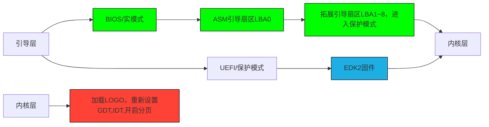

**RCOS1.0操作系统简介**
---
# 开发者
> "我是一名来自中国四线城市的13岁操作系统开发者。虽然父母未受过高等教育，但这从未限制我的求知欲——**凭借强大的自学能力和对系统底层的热爱，我正独立构建完整的操作系统**"
# 项目介绍
这是我开发的第一个操作系统，名为RCOS1.0，架构打算采用为 _IA-32_。启动方式打算采取 _BIOS/UEFI_双启动,_BIOS_ 用 _asm_ 实现，_UEFI_ 用 _EDK2_ 实现。整个操作系统基本使用 _asm_ 和 _C/C++_ 实现。
# 项目进程
正在开发，约7~14天更新仓库
## 目前项目流程
红色代表正在进行/修改的项目，绿色代表已完成项目,蓝色代表暂缓

# 希望
大家可以能为我指出问题，联系方式见下
## 联系方式
anan3055@163.com
